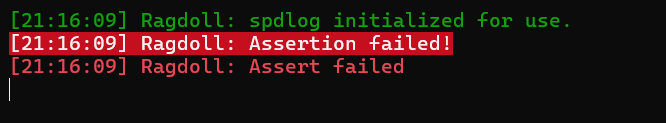

# Dependencies and spdlog
## Dependencies
### Configurations
So, how do we use easily make sure whoever uses the project easily get all the required dependencies, as well as the correct configuration to run the project? Easy, using premake and batch files too. Extending on the first blog on how to use premake, we can easily add on include directories to our projects use the lua files. With ```includedirs```, we can specifiy the paths to be used as include directories. To add on, I would create a dictionary of include directories as well as library directories, to better organize and understand that are all of the current header only/ compiled libraries I need. This also stops my scripts from looking like a amalgamation of file paths, and prevents human errors of copy pasting the paths to all the other premake scripts.
```lua
-- in Tools/dependencies.lua
IncludesDir = {}
IncludesDir["spdlog"] = "%{wks.location}/Ragdoll/dependencies/spdlog/include"

LibDirs = {}
```
```lua
includedirs
{
    "src",
    "%{IncludesDir.spdlog}"
}
```
### How to pull the dependencies in
I used a batch file as well as git to pull in all the dependencies required for the project into a dependency folder. Using a "function" similar to how most programming languages work, I can write a very simple way for me to use git to download the dependencies.
```bat
set "dependencies_path=%~dp0\..\Ragdoll\dependencies"
powershell write-host -back White -fore Black Pulling all dependencies

call :pull_dependency "spdlog" "https://github.com/buttception/spdlog.git"
call :exit
pause >nul
exit
```
Personally I would like to not redownload every dependencies I have when there is a new one added, so I would check if the path to the dependency exist first, before I proceed to use git to clone the repository into the directory. This allows me to pull only those that I do not have, and also enables to update specfic dependency by just deleting the whole directory that it resides in. The script also provides some error logging so I will know when the process explode.
```bat
:pull_dependency
powershell write-host -back White -fore Black Cloning %~1...
if exist "%dependencies_path%\%~1" (
    powershell write-host -back Yellow -fore Black %~1 exists. Delete the folder if updating is required.
) else (
    git clone %~2 "%dependencies_path%\%~1" 
    if errorlevel 1 (
       powershell write-host -back Red -fore Black Error pulling %~1 from %~2
    ) else (
       powershell write-host -back Green -fore Black %~1 cloned succesfully.
    )
)
goto:eof
```
Of course this is only possible with header only dependencies, but I will go into how I can pull dependencies that needs to be compiled in the future.
## spdlog
We need a fast logging tool for the engine, hence I chose spdlog. It is highly performant as it is has asynchronous logging, a simple API for easy use, and provides multiple types of sinks for me to do logging to file or logging into the editor GUI next time.

I created 2 loggers to differentiate between a log coming from the engine itself, or logs coming from log calls coming from the scripting system, which are user made. This are easily used together with macros as well
```cpp
// in Ragdoll/src/Ragdoll/Core/Logger.h
static inline std::shared_ptr<spdlog::logger> s_CoreLogger;
static inline std::shared_ptr<spdlog::logger> s_ClientLogger;

#define RD_CORE_TRACE(...) ::Ragdoll::Logger::GetCoreLogger()->trace(__VA_ARGS__)
#define RD_CORE_INFO(...) ::Ragdoll::Logger::GetCoreLogger()->info(__VA_ARGS__)
#define RD_CORE_WARN(...) ::Ragdoll::Logger::GetCoreLogger()->warn(__VA_ARGS__)
#define RD_CORE_ERROR(...) ::Ragdoll::Logger::GetCoreLogger()->error(__VA_ARGS__)
#define RD_CORE_FATAL(...) ::Ragdoll::Logger::GetCoreLogger()->critical(__VA_ARGS__)

#define RD_CLIENT_TRACE(...) ::Ragdoll::Logger::GetClientLogger()->trace(__VA_ARGS__)
#define RD_CLIENT_INFO(...) ::Ragdoll::Logger::GetClientLogger()->info(__VA_ARGS__)
#define RD_CLIENT_WARN(...) ::Ragdoll::Logger::GetClientLogger()->warn(__VA_ARGS__)
#define RD_CLIENT_ERROR(...) ::Ragdoll::Logger::GetClientLogger()->error(__VA_ARGS__)
#define RD_CLIENT_FATAL(...) ::Ragdoll::Logger::GetClientLogger()->critical(__VA_ARGS__)
```
I use spdlog in conjunction with asserts, to stop the program from executing at a certain point if the issue posed is big enough, with some nice formatting on the error message. Asserts in release mode will not be able pause the program, and hence I will just let it continue running until it crashes somewhere else instead. Perhaps I should have a fatal assert that aims to crash the program and collect relevant data to have a safer exit point for the program.
```cpp
// Assert macros
#ifdef RAGDOLL_ENABLE_ASSERTS
	#define RD_ASSERT(x, ...) do { if(x) { RD_CORE_FATAL("Assertion failed!"); RD_CORE_ERROR(__VA_ARGS__); __debugbreak(); } } while (0)
#else
	#define RD_ASSERT(x, ...) do { if(x) { RD_CORE_FATAL("Assertion failed!"); RD_CORE_ERROR(__VA_ARGS__); } } while (0)
#endif
```
The following lines of code will give me these logs
```cpp
RD_CORE_INFO("spdlog initialized for use.");
RD_ASSERT(true, "Assert failed");
```
