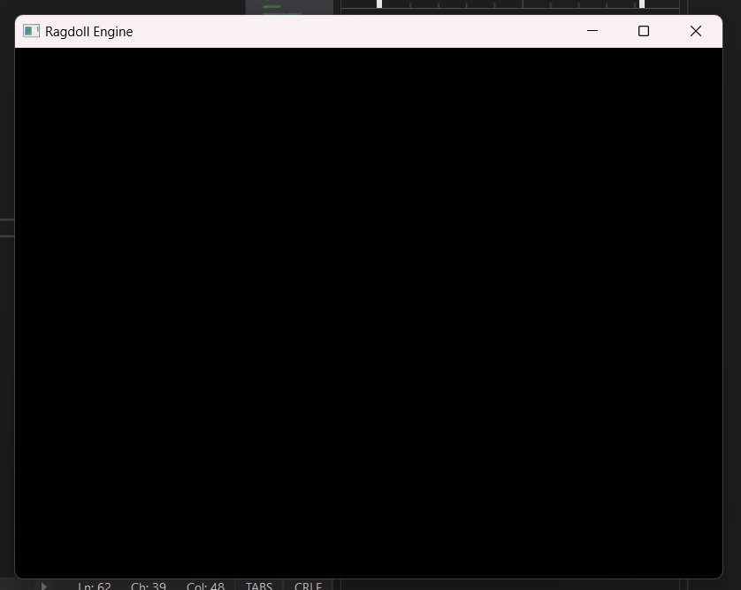

# Our first window
In order to create our first window we will be using GLFW, a open-source library designed to provide a simple API for creating and managing windows with OpenGL contexts, handling input (keyboard, mouse, etc.), and managing other tasks related to graphics and window management.

## Key Features of GLFW:
**Window Creation and Management**:
- Provides functions to create windows and OpenGL contexts.
- Allows for the creation of multiple windows and contexts.

**Input Handling**:

- Handles keyboard, mouse, and joystick input.
- Provides callbacks to respond to various input events.

**OpenGL Context Management**:

- Facilitates the creation of OpenGL contexts and the management of context states.

**Cross-Platform**:

- Supports multiple operating systems including Windows, macOS, and Linux.
- Provides a consistent API across different platforms.

**Event Handling**:

- Supports event-driven programming with callback functions for various events like window resizing, key presses, and mouse movements.

**Time Management**:

- Provides functions to measure time and manage time-related tasks.

## A dependency that is a library
Instead of doing the usual way of compiling the library and then linking it to the project, I opted to compile GLFW and Glad as part of my library instead, owing to the open-source nature of the project. This keeps the amount of libraries I have to link at runtime to a minimum.

Firstly, I had to fork GLFW and add in a premake script to create the project. In Glad case, I use the online loader-generator to get the files I need, and simply created a repository to store them. Using the method in the previous blog, I simply cloned these repositories, and linked my Ragdoll project directly with them.
```bat 
call :pull_dependency "glfw" "https://github.com/buttception/glfw.git"
call :pull_dependency "glad" "https://github.com/buttception/Glad.git"
```
```lua
links
{
    "GLFW",
    "Glad"
}
```
This allowed me to compile GLFW and Glad as part of my library. There will be cases where I will not be able to do this in the future simply because the libraries do not have their source code exposed to the public. I will have to manually link them in the future.

## Creating the window
Of course, in order to create the GLFW window, I first have to initialize it. I used a static class ```GLFWContext``` to hold all the relevant information about GLFW, and initialize during the application creation. This is followed up by the creation of the window.
```cpp
GLFWContext::Init();

m_PrimaryWindow = std::make_shared<Window>();
m_PrimaryWindow->Init();
```
The window will have 2 phases in the update loop, the start and the end of the frame. The window will poll for inputs at the start of the frame, and will swap the buffer at the end of the frame.
```cpp
void Window::StartRender()
{
    glfwPollEvents();
}

void Window::EndRender()
{
    glfwSwapBuffers(m_GlfwWindow);
}
```
You will notice a problem, the window is not reacting to any inputs now. The callbacks for these events will be added next, and it will become a functioning window in the next part.
