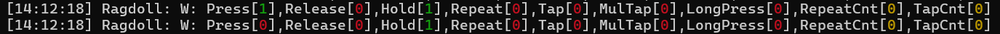
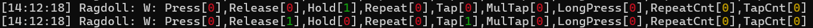
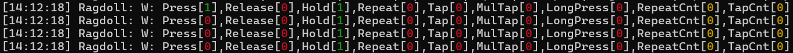
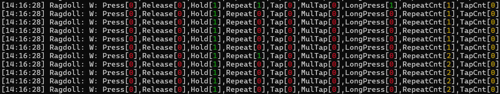
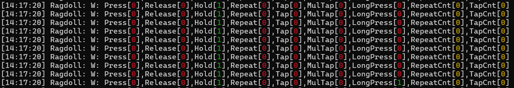
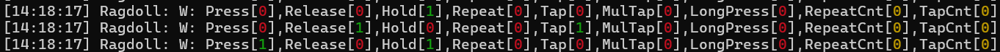
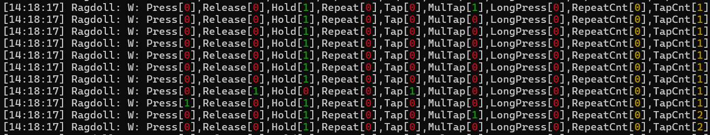

# Keyboard Inputs
The input handler will respond to the input events raised by the Window through the application. The InputStates that are returned from GLFW are
- ```GLFW_PRESS``` : The key is down
- ```GLFW_RELEASE``` : The key was down, and then became up
- ```GLFW_REPEAT``` : The key is held down, raised at intervals similar to how key hold is like for typing.

With these 3 states, we can write a robust input handler for key inputs.

## Input Handler
The input handler is incharge of keeping tabs on all input accepted by the engine, such as keyboard, mouse and gamepad inputs. It will contain the states of all the keys recognized by GLFW, and will provide more complex states such as multi tapping and etc. The ```KeyPressedEvent``` will keep track of what key is pressed, as well as if it is a repeat press or not.
```cpp
//in Ragodll/src/Ragdoll/Graphics/Window/Window.cpp
glfwSetKeyCallback(m_GlfwWindow, [](GLFWwindow* window, int _key, int _scancode, int _action, int _mods)
{
	Window& data = *static_cast<Window*>(glfwGetWindowUserPointer(window));

	switch (_action)
	{
	case GLFW_PRESS:
	{
        //create the event with the key, and 0 for repeat since this is press
		KeyPressedEvent event(_key, 0);
		if (data.m_Callback != nullptr)
			data.m_Callback(event);
		break;
	}
    //the other states
});
```
Once the application callback is called, it will call the relevant input handler function.
```cpp
//in Ragdool/src/Ragdoll/Application.cpp
bool Application::OnKeyPressed(KeyPressedEvent& event)
{
    m_InputHandler->OnKeyPressed(event);
    return false;
}
```
## Key Inputs
Since there are hundreds of keys, I try my best to keep the data size used to keep track of the key states to a minimun size. I managed to reduce the size of ```InputData``` to 16 bytes. The states that I keep track of are:
```cpp
//in Ragdoll/src/Ragdoll/Input/InputHandler.h
struct InputState
{
	unsigned int m_Press : 1 { 0 };                     //press
	unsigned int m_Release : 1 { 0 };                   //release
	unsigned int m_Hold : 1 { 0 };                      //held down
	unsigned int m_Repeat : 1 { 0 };                    //repeat state like typing
	unsigned int m_LongPress : 1 { 0 };                 //key held for long time
	unsigned int m_Tap : 1 { 0 };                       //key released after a short time
	unsigned int m_MultiTap : 1 { 0 };                  //key pressed multiple times
                                                        //within a short time
	unsigned int m_LongPressTriggered : 1 { 0 };        //flag to not trigger long press
                                                        //more than once
	unsigned int m_IncrementMultiTapTimer : 1 { 0 };    //flag to know the key is 
                                                        //applicable for multi tapping
	unsigned int : 23;                                  //anonymous unused bitfield
};
```
This key state will share bits with the multi tap counter, which in this case is 23 bits. If I need more flags in the future, I can cannibalize more bits from the tap counter. I doubt the user will tap more than a couple hundred thousand times. The ```InputData``` struct will then contain the rest of the information I need, such as repeat count and timers.
```cpp
//in Ragdoll/src/Ragdoll/Input/InputHandler.h
struct InputData
{
    //anonmyous union
	union
	{
        //InputState already padded the next 23 bits for use for tap count
		InputState m_InputState;
		struct
		{
			unsigned int : 9;   //anonmymouse bitfield for states
			unsigned int m_TapCount : 23;   //the actual tap count
		};
	};
    //the rest of the info I will need
	float m_HeldTimer{ 0.f };
	float m_MultiTapTimer{ 0.f };
	unsigned int m_RepeatCount{ 0 };

    //constructor needed to initialize all of the values to be 0 for the bitfields
	InputData() : m_InputState{ 0 } {}
	~InputData() {}
};
```
With these information, I will be able to do the additional functionality for the special key presses. The time needed to trigger these special presses are defined as ```const static``` variables in the input handler, and can be changed in code.
```cpp
//how long the key is held down for a long press to be triggered
inline const static float s_LongPressTime = 0.5f;
//time between taps to be registered as a multi tap
inline const static float s_MultiTapTime = 0.2f;
//time before a key hold is considered not a tap when released
inline const static float s_TapTime = 0.3f;
```
All of the ```InputData``` will be stored in a big array, where I can direct access them using the value of the key enums.
```cpp
InputData m_Keys[static_cast<int>(Key::MaxKey)];
```
```cpp
enum class Key
{
    //other enums...
	A = 65, //in this case it will be index 65
    //more enums...
```
So onto how I set the InputStates for use in the engine. I won't delve into the code here, but I will give some concepts that I used to write the features.
- ```m_Press```:
    - ```1```: ```m_Hold``` is ```0``` and ```GLFW_PRESS``` is triggered.
    - ```0```: Otherwise.

- ```m_Release```:
    - ```1```: ```GLFW_RELEASE``` is triggered.
    - ```0```: Otherwise.

- ```m_Hold```:
    - ```1```: ```GLFW_PRESS``` is triggered.
    - ```0```: ```GLFW_RELEASE``` is detected.

- ```m_Repeat```:
    - ```1```: When ```GLFW_REPEAT``` is triggered.
    - ```0```: Otherwise.
    - ```Note```: Increments ```m_RepeatCount``` when ```1```

- ```m_LongPress```:
    - ```1```: If ```m_Hold``` is still ```1``` once ```m_HeldTimer``` > ```s_LongPressTime```.
    - ```0```: Otherwise. ```m_LongPressTriggered``` will be set to ```0``` when ```GLFW_RELEASE``` is triggered.
    - ```Note```: When ```m_Hold``` is ```1``` and ```m_LongPressTriggered``` is ```0```, ```m_HeldTimer``` will run. Set ```m_LongPressTriggered``` to ```1``` when ```1```.

- ```m_Tap```:
    - ```1```: When ```m_Release``` is ```1``` and ```m_HeldTimer``` < ```s_TapTime```.
    - ```0```: Otherwise.

- ```m_MultiTap```:
    - ```1```: When ```m_Press``` is ```1```, ```m_IncrementMultiTapTimer``` is ```1``` and ```m_MultiTapTimer``` < ```s_MultiTapTime```.
    - ```0```: Otherwise.
    - ```Note```:  Increments ```m_TapCount``` as well when ```1```. ```m_IncrementMultiTapTimer``` will be set to ```1``` whenever ```m_Release``` is ```1```. ```m_IncrementMultiTapTimer``` will run ```m_MultiTapTimer```.


With this, the input handler just needs to be used by other systems of the engine which I won't go into in this blog. You can try to write your own implementation on how to use the ```InputData``` here in your own engine.