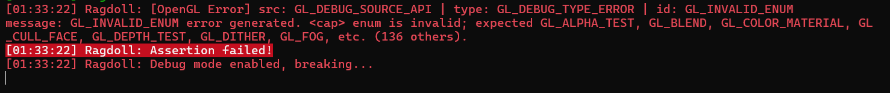
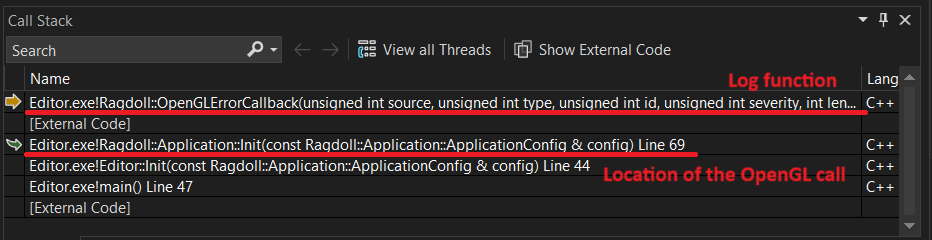
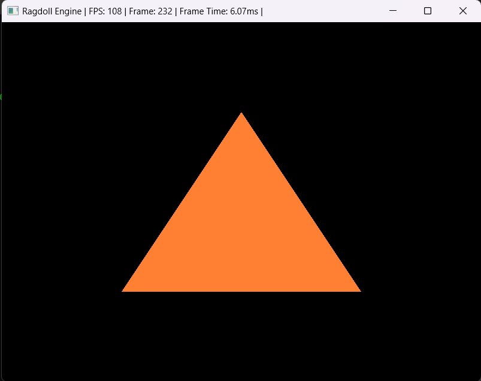
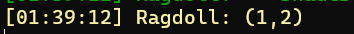

# First Triangle
## OpenGL
OpenGL (Open Graphics Library) is a cross-platform, industry-standard API for rendering 2D and 3D vector graphics. It abstracts the underlying graphics hardware, allowing developers to create high-performance graphics applications without needing to write directly to the GPU. OpenGL is widely used in video games, simulations, CAD applications, and other applications requiring rich visual output.

I chose OpenGL over Vulkan because OpenGL is simpler to implement, especially when multithreading isn't a priority. Unlike Vulkan, which offers more control and better performance scaling with multithreading, OpenGL provides a more straightforward and easier-to-use interface. All these just means I'm bad at dealing with multi threaded applications and don't have the time to commit into learning it.

I used [Glad](https://glad.dav1d.de/) to load all the OpenGL core and extensions functionality. If you have specific need for your toolset, you can exclude unneeded extensions to make your loader smaller.

```cpp
int status = gladLoadGLLoader(reinterpret_cast<GLADloadproc>(glfwGetProcAddress));
RD_CRITICAL_ASSERT(!status, "Failed to initialize Glad.");
```

Then I did some checks to make sure the user machine has the required OpenGL version, 4.6.

```cpp
int versionMajor, versionMinor;
glGetIntegerv(GL_MAJOR_VERSION, &versionMajor);
glGetIntegerv(GL_MINOR_VERSION, &versionMinor);

RD_CRITICAL_ASSERT(versionMajor != 4 || versionMinor < 6, "Ragdoll Engine requires OpenGL version 4.6");
```

### OpenGL Debug Output
The old way of checking for errors, where you would try to check if there was any errors after every OpenGL calls, poses significant performance overhead. You can always only check in debug mode, but further down development, debug mode sometimes become quite unplayable due to the low framerate. To curb this issue, OpenGL actually supports a event based system to log errors. This can be enabled by

```cpp
glEnable(GL_DEBUG_OUTPUT);
```

Simply register a debug callback function to it, where in my case would only assert if a OpenGL error is detected, and you can avoid the problems of checking for error on every call. It even gives you messages of lower severity, which you may use to prevent future errors and bugs.

```cpp
glDebugMessageCallback(OpenGLErrorCallback, 0);
//code...

void OpenGLErrorCallback(GLenum source, GLenum type, GLuint id, GLenum severity, GLsizei length, const GLchar* message, const void* userParam)
{
switch(severity)
{
    case GL_DEBUG_SEVERITY_HIGH:
        RD_CORE_ERROR("[OpenGL Error] src: {} | type: {} | id: {}\nmessage: {}", GLenumErrorToString(source), GLenumErrorToString(type), GLenumErrorToString(id), message);
        //assert if got errors
        RD_ASSERT(true, "Debug mode enabled, breaking...");
//more code
```



However, the debug break isn't really useful, as in the callstack, you can't see where it is coming from. With abit of performance overhead, you can enable ```GL_DEBUG_OUTPUT_SYNCHRONOUS``` which insteads log the message immediately when an error occurs. This with ```__debugbreak()``` can help you locate the source of the error.

```cpp
glEnable(GL_DEBUG_OUTPUT_SYNCHRONOUS);
```



### Our first triangle
The biggest thing to note is that OpenGL is essentially a large state machine. The OpenGL functions you call in you call, does not actually happens until ```glfwSwapBuffers(...)``` is actually called. This may not be important for you now, but maybe important when you begin to profile the renderer using the visual studio built in profiler or with some timers, and become perplexed as to why ```glfwSwapBuffers(...)``` is taking so long. So below details the steps needed to draw a simple triangle, to get you up to speed on what the flow will be like.
1. First step is to create the shaders need to draw the object. We only need a simple vertex and fragment shader. We will need to compile them into shader objects then link them with a shader program.
    - The vertex stage usually occurs first to transform your vertices in whatever space you have to whatever space you want it to be in. One example would be from world space to camera space.

    ```glsl
    #version 460 core   //version of opengl used
    layout (location = 0) in vec3 aPos; //takes in the position

    void main()
    {
        gl_Position = vec4(aPos, 1.0);  //outputs the position to the fragment shader
    }
    ```

    - The fragment stage will then color every pixel that is within this triangle primitive formed by the vertex shader. It can do texturing, lighting and etc.

    ```glsl
    #version 330 core
    out vec4 FragColor; //outputs the fragment color

    void main()
    {
        FragColor = vec4(1.0, 0.5, 0.2, 1.0);   //colors the pixel a hardcoded color
    }
    ```

    - Compile them and link them. Do some verifications too.

    ```cpp
    glShaderSource(vertexShader, 1, &vertexShaderSource, NULL);
    glCompileShader(vertexShader);
    //verifications...
    glShaderSource(fragmentShader, 1, &fragmentShaderSource, NULL);
    glCompileShader(fragmentShader);
    //verifications...
    glAttachShader(shaderProgram, vertexShader);
    glAttachShader(shaderProgram, fragmentShader);
    glLinkProgram(shaderProgram);
    //verifications...
    ```

2. Create the ```Vertex Buffer``` and ```Vertex Array``` objects. This stores all the vertices data for the drawn primitive, and are the inputs to the vertex shader mentioned above. One key thing to note is that in the ordering of the vertices, try to order in a anti-clockwise manner where the shape form will be facing you. This is use to do backface culling, where the rear end of the shape is culled from being rendered. First we will create the array of vertices to represent the triangle.

    ```cpp
    GLfloat vertices[] = {
        top.x, top.y, top.z, // Top
        botLeft.x, botLeft.y, botLeft.z, // Bottom Left
        botRight.x, botRight.y, botRight.z  // Bottom Right
    };
    ```

    Then we create the ```Vertex Buffer Object```, or ```VBO```, and the ```Vertex Array Object```, or ```VAO```. This are buffers where we reference with a integer, that is current in the GPU memory. 
    - ```VBO``` are buffer objects, they can store any data needed to draw a mesh such as positions, colors, normals, and texture coordinates. In our case, it stores the position of the triangle. We can actually bind more than one ```VBO``` to an ```VAO```
    - ```VAO``` are objects that specify how we use the data in the ```VBO```. ```VAO```s store the configuration of vertex attributes, which includes how data is laid out in the VBOs (e.g., offsets, strides, and attribute pointers). This allows you to switch between different configurations easily by binding different VAOs.
    
    Like I mentioned above, OpenGL is a large state machine, and won't work in a normal object oriented fashion. ```glBindVertexArray(VAO);``` will make the ```VAO``` the currently binded vao in the context, and only 1 can be binded at any given time. This is why we will need to unbind the ```VAO``` with ```glBindVertexArray(0)``` to prevent the ```VAO``` from being accidentally used or changed in subsequent OpenGL calls.
    ```cpp
    //generate the integers that will map to a vertex array or buffer in the GPU
    GLuint VBO, VAO;
    glGenVertexArrays(1, &VAO);
    glGenBuffers(1, &VBO);

    //bind the vao
    glBindVertexArray(VAO);

    //bind the vbo
    glBindBuffer(GL_ARRAY_BUFFER, VBO);
    //actually create the buffer object in the GPU with the size of the vertices provided above
    glBufferData(GL_ARRAY_BUFFER, sizeof(vertices), vertices, GL_STATIC_DRAW);

    //tell the VAO what the layout of the buffer object is, in this case, 3 floats in order
    glVertexAttribPointer(0, 3, GL_FLOAT, GL_FALSE, 3 * sizeof(GLfloat), (GLvoid*)0);
    glEnableVertexAttribArray(0);

    //unbind the vbo. glVertexAttribPointer has binded the vbo to the vao, and thus won't cause any issue in this call
    glBindBuffer(GL_ARRAY_BUFFER, 0);

    //unbind the vao
    glBindVertexArray(0);
    ```
3. Use the shader program and VAO to draw the triangle. This final step is the easiest, as we just need to use the things we prepared above.
```cpp
//bind the shader program to be used
glUseProgram(shaderProgram);
//bind the object to be used
glBindVertexArray(VAO);
//draw the triangle, in this case it will draw 1 triangle, from index 0 and 3 vertices.
glDrawArrays(GL_TRIANGLES, 0, 3);
//unbinde the vao
glBindVertexArray(0);
```
With this we have our first triangle!


## glm
Firstly, to have a proper renderer in the engine, we are gonna need a lot of math. I hope the readers are already proficient with linear algebra, as I won't go much into them. I chose glm as our math library, but why glm?
- The syntax of glm closely mirrors GLSL, which is the primary shader language I'll be using moving on.
- Header only, means it is very easy to add into any project.
- I used it before.

## Logging custom types
So with glm comes a new problem, how can I log these objects with spdlog? spdlog uses the fmt library to format the text and decide what to write to the console. In order to get spdlog to take a, let's say the glm::vec2 object, and write to console without us specifying some thing like ```("({}, {}), vec.x, vec.y)``` everytime we want to write it to the console, we need to give it a ```std::ostream``` ```operator<<``` overload.

```cpp
//in Ragdoll/src/Ragdoll/Core/Logger.h
inline std::ostream& operator<<(std::ostream& os, const glm::vec2& vec){
	return os << "(" << vec.x << ", " << vec.y << ")";
}
```

However, with a recent update to fmt, i believe with fmt:v10 onwards, only the ostream operator overload is not enough to make it work now. We need to explictly specify a template specialization for fmt to use the ostream formatter, and hence the following code.

```cpp
//take note we need to include spdlog/fmt/bundled/ostream.h
template <> struct fmt::formatter<glm::vec2> : ostream_formatter {}
```

Writing this alot of times is quite painful, thus I wrote a macro to help out.

```cpp
#define RD_LOG_OVERLOAD_USERTYPE(type, var, format)\
inline std::ostream& operator<<(std::ostream& os, const type& var){\
	return os << format;\
}\
template <> struct fmt::formatter<type> : ostream_formatter {}

RD_LOG_OVERLOAD_USERTYPE(glm::ivec2, vec, "(" << vec.x << "," << vec.y << ")");
```

